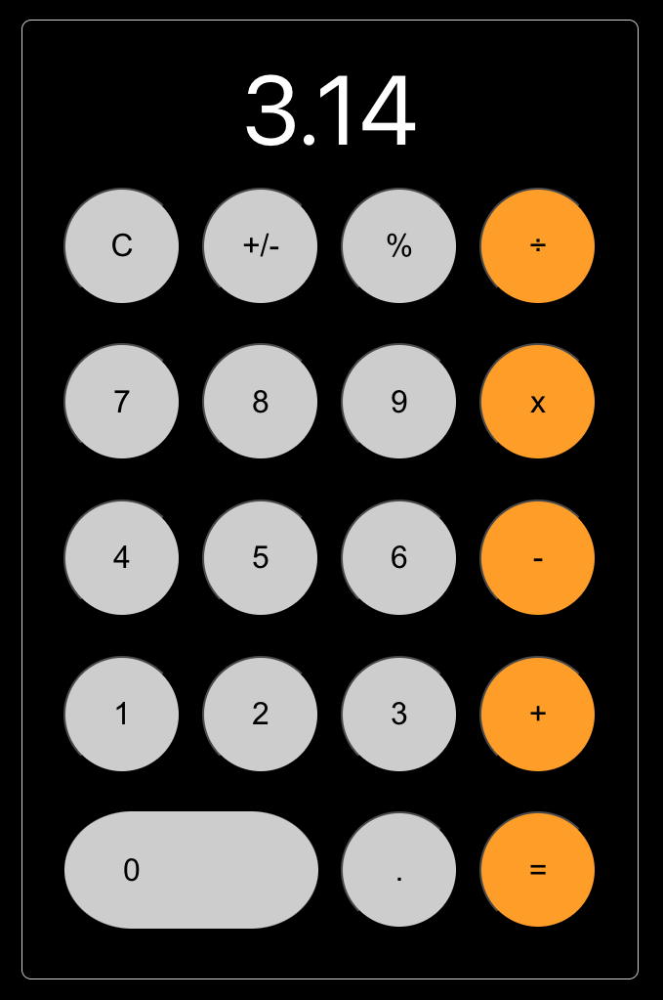

# React IOS Calculator

This project recreates the iconic iOS calculator interface using ReactJS. Designed to mimic the look and functionality of the native iOS calculator, this application provides a familiar user experience for desktop web browsers. 

    
    

## Requirements

NodeJS v21.7.1

## Usage

1. clone project   
2. open project `cd react-ios-calculator`
3. install npm `npm i`
4. run in dev mode `npm start`

## Credits
 
Developer - Samuel Fok (@foks20)

Mentor - Randy Lopez (@quantyle)
 
## License
 
The MIT License (MIT)

Copyright (c) 2015 Samuel Fok

Permission is hereby granted, free of charge, to any person obtaining a copy of this software and associated documentation files (the "Software"), to deal in the Software without restriction, including without limitation the rights to use, copy, modify, merge, publish, distribute, sublicense, and/or sell copies of the Software, and to permit persons to whom the Software is furnished to do so, subject to the following conditions:

The above copyright notice and this permission notice shall be included in all copies or substantial portions of the Software.

THE SOFTWARE IS PROVIDED "AS IS", WITHOUT WARRANTY OF ANY KIND, EXPRESS OR IMPLIED, INCLUDING BUT NOT LIMITED TO THE WARRANTIES OF MERCHANTABILITY, FITNESS FOR A PARTICULAR PURPOSE AND NONINFRINGEMENT. IN NO EVENT SHALL THE AUTHORS OR COPYRIGHT HOLDERS BE LIABLE FOR ANY CLAIM, DAMAGES OR OTHER LIABILITY, WHETHER IN AN ACTION OF CONTRACT, TORT OR OTHERWISE, ARISING FROM, OUT OF OR IN CONNECTION WITH THE SOFTWARE OR THE USE OR OTHER DEALINGS IN THE SOFTWARE.
